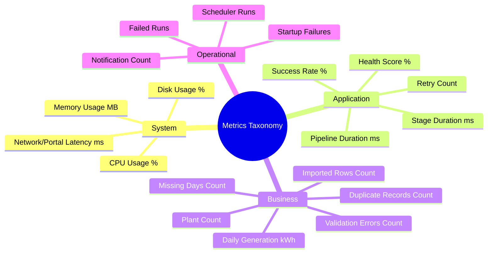

# Sprint 13 Mimari Tasarım ve Gözlemlenebilirlik Raporu: Metrics & Observability

Bu rapor, **SolarReportAutomation** platformunun Sprint 13 kapsamında eklenecek olan Metrik ve Gözlemlenebilirlik (Metrics & Observability) altyapısının teknik mimari tasarımını sunmaktadır.

---

## 1. Mimari Vizyon ve Hedef Değerlendirmesi

Sprint 12 (Release Candidate RC-1) ile platformumuz kararlı ve dirençli (resilient) hale gelmiştir. Sprint 13'ün amacı, bu dirençli yapıyı performans ve iş (business) odaklı gözlemlenebilir kılmaktır.
- **Odak**: Sistem kaynaklarının durumu, ETL aşama performansları, iş doğruluğu ve operasyonel kararlılık tek bir metrik frameworkü (`IMetric`) üzerinden toplanacak ve dışa aktarılacaktır.

---

## 2. Metrik Taksonomisi (Metrics Taxonomy)

Toplanacak metrikler 4 ana gruba ayrılarak şemalandırılmıştır. Bu taksonomi ileride Dashboard ve REST API tarafından doğrudan tüketilecektir:



---

## 3. Metrik Altyapısı Mimarisi (Metrics Architecture Framework)

YAGNI ve Açık/Kapalı (Open/Closed - OCP) prensiplerine tam uyum için metrik mimarisi aşağıdaki arayüzler ve soyutlamalar üzerine kurulmuştur:

```text
  MetricsCollector (Veri Toplama)
        │
        ▼
  MetricsRegistry  (Veri Kayıt ve Dağıtım)
        │
        ├──────────────────────────┐
        ▼                          ▼
  ConsoleMetricExporter     DatabaseMetricStorage (IMetricExporter)
  (Prometheus Format)       (notification_history / etl_runs / performance_metrics)
```

### 3.1. Arayüzler ve Modeller

- **`IMetric`**: Metrik tipini temsil eden taban soyut sınıf (Counter, Gauge, Histogram).
- **`MetricsRegistry`**: Sistemdeki tüm aktif metrikleri bellek üzerinde tutar ve exporter'lara besler.
- **`IMetricExporter`**: Metrikleri dış sistemlere (Console, DB, Prometheus scraping vb.) ihraç eden ortak sözleşme.

---

## 4. Gözlemlenebilirlik ve Korelasyon Tasarımı (Observability)

Sadece tekil metrikler yerine, metriklerin loglar ve hatalarla ilişkilendirilmesi (correlation) için şu tasarım kararları alınmıştır:
- **Correlation ID (Run ID)**: Toplanan her metrik satırı ve log kaydı, o pipeline çalışmasının benzersiz `run_id` değerini taşır.
- **Stage ID**: Aşamaya özgü metrikler (örn: `Download` veya `Validation` süresi) ilgili stage etiketleriyle (`stage_name`) işaretlenir.
- **Structured Metrics**: Loglar ve veritabanı kayıtları JSON formatında meta veri etiketlerini (`labels`) barındırarak kolayca parse edilebilir.

---

## 5. Veritabanı Şema Önerisi (Database Schema Proposal)

Metriklerin kalıcı olarak saklanması ve geçmişe dönük trend analizi yapılabilmesi için `performance_metrics` tablosu tasarlanmıştır:

```python
class PerformanceMetric(Base):
    __tablename__ = "performance_metrics"

    id = Column(Integer, primary_key=True, autoincrement=True)
    run_id = Column(String(36), nullable=False)          # Korelasyon için pipeline Run ID
    stage_name = Column(String(100), nullable=True)       # İlgili ETL Stage adı (örn: Validation)
    metric_category = Column(String(50), nullable=False)  # System, Application, Business, Operational
    metric_name = Column(String(100), nullable=False)     # Örn: cpu_usage_percent
    metric_value = Column(Numeric(12, 4), nullable=False) # Sayısal değer
    labels = Column(Text, nullable=True)                  # JSON string formatında ek etiketler
    timestamp = Column(DateTime, default=datetime.utcnow) # Zaman damgası
```

---

## 6. Risk Analizi ve Başarı Kriterleri

### Risk Analizi
- **Sistem Yükü**: CPU/Memory sorgulamanın işletim sistemine ek yük getirmesi. *Önlem*: Metrik toplama aralıkları yüksek tutulacak (saniyeler mertebesinde değil, aşama sonlarında) ve hafif kütüphaneler tercih edilecektir.
- **Veri Boyutu**: SQLite veya PostgreSQL üzerinde metrik satırlarının hızlı şişmesi. *Önlem*: Metrik verileri için 30 günlük otomatik temizleme (data retention/purge) politikası uygulanacaktır.

---

## 7. Definition of Done (DoD) & Sprint Breakdown

### Definition of Done
1. [ ] `PerformanceMetric` veritabanı tablosu ve ORM entegrasyonu tamamlandı.
2. [ ] `MetricsCollector` ile sistem, uygulama, iş ve operasyonel metriklerin tamamı toplanabiliyor.
3. [ ] Metrikler console loglarına Prometheus uyumlu veya yapılandırılmış (structured JSON) formatta basılabiliyor.
4. [ ] ETL pipeline süresine etkisi %1'in altında.
5. [ ] Geriye dönük uyumluluk (Sprint 12 RC-1 mimarisi) korundu.

### Sprint Breakdown (İş Kırılımı)
- **Task 1**: `performance_metrics` ORM modellerinin eklenmesi ve DB migration hazırlığı.
- **Task 2**: `IMetric` ve `MetricsRegistry` framework yapısının kurulması.
- **Task 3**: `MetricsCollector` (System, App, Business ve Operational toplayıcılar) yazılması.
- **Task 4**: `ConsoleMetricExporter` ve `DatabaseMetricStorage` yazılması.
- **Task 5**: `ETLOrchestrator` ve `main.py` üzerine metrik enjeksiyonlarının yapılması.
- **Task 6**: Entegrasyon ve duman (smoke) testlerinin yapılması.
